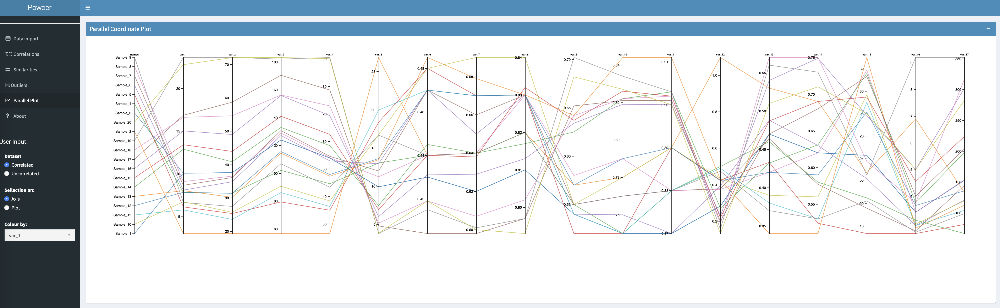

# data_analysis_workflow_app

R Shiny web application tailored to streamline the analysis of numerical data (e.g. characterisation of samples with various analytical techniques) to provide insight into sample similarity and overall trends.   

Key features include:  
- **Data Import:** Seamlessly import user data files, with the flexibility to select specific columns for analysis and exclude rows as needed.
- **Statistical Summary:** Generate statistical summaries of the dataset, providing essential insights at a glance.
- **Cross-Correlation Analysis:** Identify and analyze pair-wise correlations among variables, with automatic removal of highly correlated variables to meet user-defined threshold, enhancing the robustness of subsequent analyses.
- **Visualize Correlations:** Intuitively visualize pair-wise correlations through interactive plots, aiding in the exploration and interpretation of relationships within the data.
- **Hierarchical Clustering:** Utilize hierarchical clustering to assess similarity among observations, with support for estimating the optimal number of clusters via a Silhouette plot and a histogram based on 30 indices (NBClust package), allowing users to uncover underlying patterns more effectively.
- **PCA Dimensionality Reduction:** Optionally reduce the dimensionality of the dataset through Principal Component Analysis (PCA) prior to hierarchical clustering, enabling more efficient analysis of high-dimensional data.
- **Clustering and Outlier Detection:** Employ DBSCAN algorithm for clustering and outlier detection, facilitating the identification of distinct groups or anomalies within the data.
- **Interactive Data Visualization:** Visualize dataset rows/samples dynamically, both pre and post cross-correlation analysis using a Parallel plot , with customizable filtering options 'on axis' or 'on plot', allowing users to explore and interact with the data effortlessly.

